# Hero Intros

Recommended compisition:

* 1 Tank
* 2 Fighters
* 1 Support Unit

## Diala Passil

* **Class** Melee
* **Strategy** Fighter/Tank Support

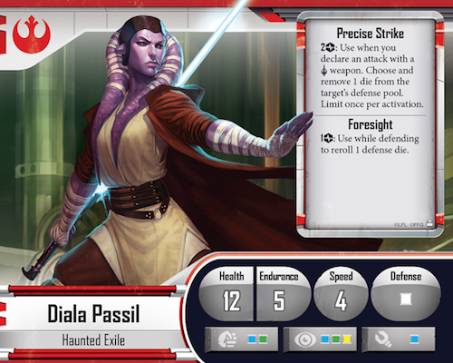

## Fenn Signis

* **Class** Ranged
* **Strategy** Fighting unsupported

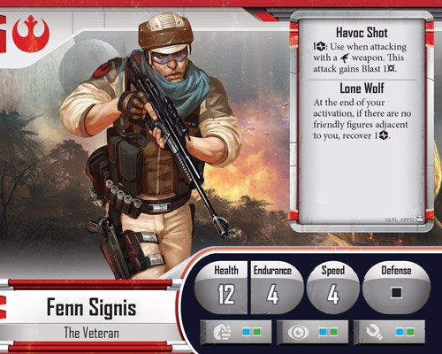

## Gaarkhan

* **Class** Melee
* **Strategy** Fighter/Tank

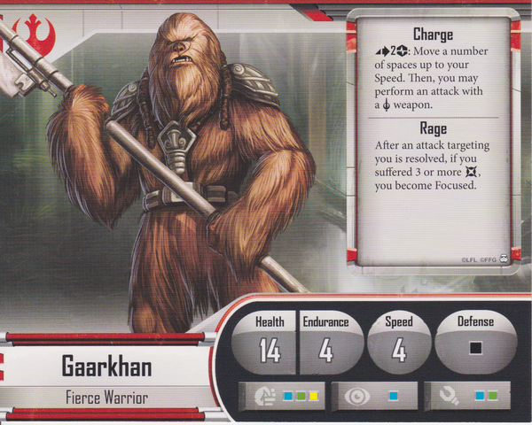

## Gideon Argus

* **Class** Ranged
* **Strategy** Support/Utilize other units

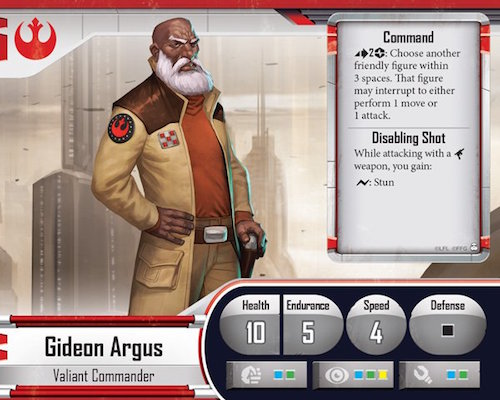

## Jyn Odan

* **Class** Ranged
* **Strategy** Fighter/Tank Support/Objective and positioning focused

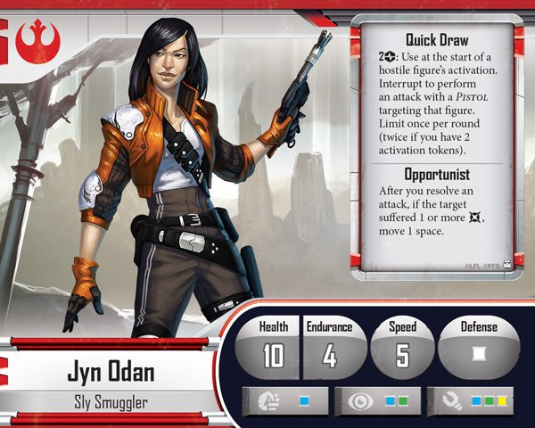

## Mak Eshka'rey

* **Class** Ranged
* **Strategy** Ranged Fire

## Biv Bodhrik

* **Class** Ranged and Melee
* **Strategy** Tank

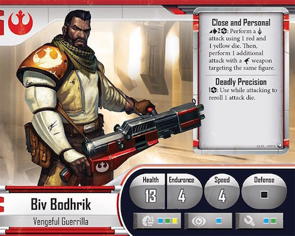

## Saska Teft

* **Class** Ranged
* **Strategy** Support and equip allies

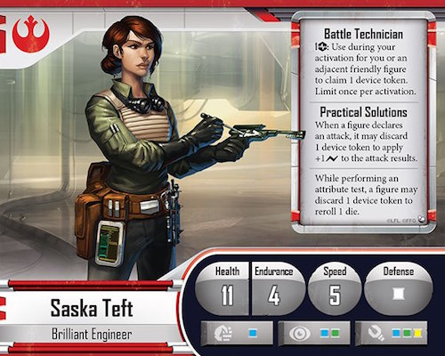

## Loku Kanoloa

* **Class** Ranged
* **Strategy** Ranged Fire (sniper)

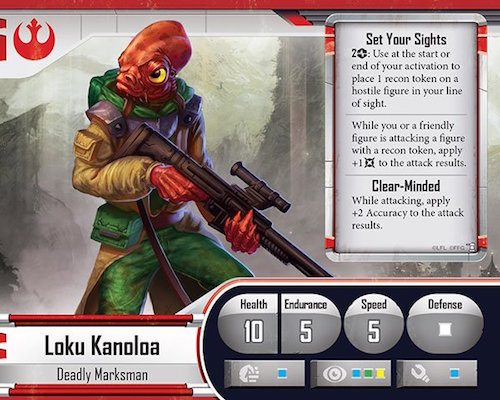

## MHD-19

* **Class** Ranged
* **Strategy** Support and heal units

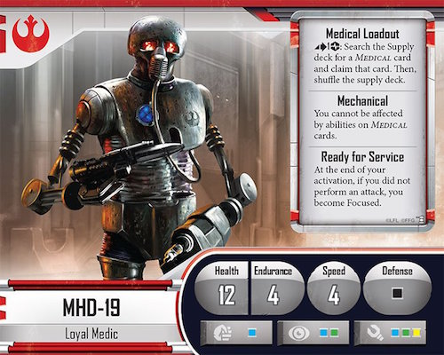

## Verena Talos

* **Class** Ranged and Melee
* **Strategy** Fighter/Tank Support/Enemy Executor

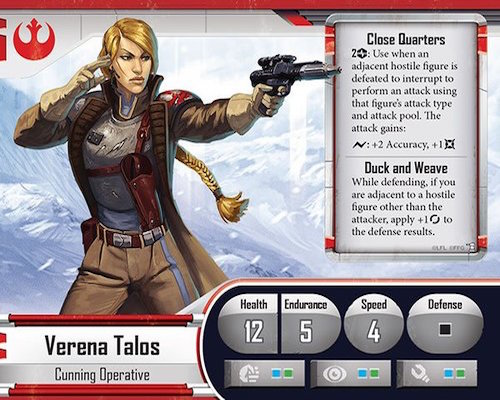

## Davith Elso

* **Class** Melee
* **Strategy** Fighter/Tank Support/Objective and positioning focused

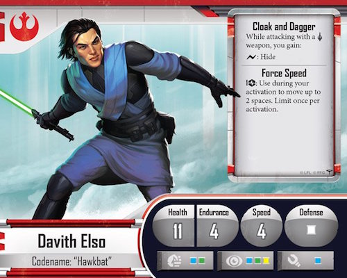

## Murne Rin

* **Class** Ranged
* **Strategy** Support/Deception 

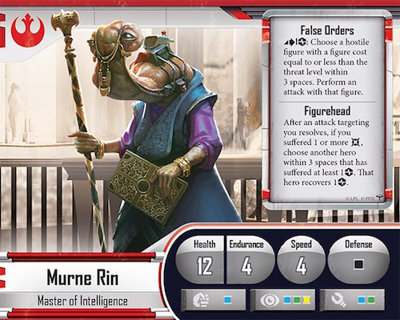

## Onar Koma

* **Class** Ranged
* **Strategy** Tank

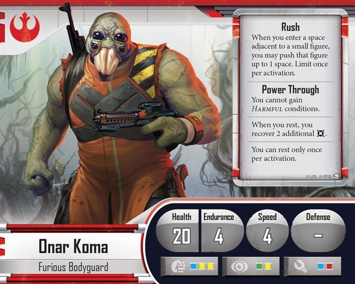

## Shyla Varad

* **Class** Melee
* **Strategy** Fighter/Tank Support

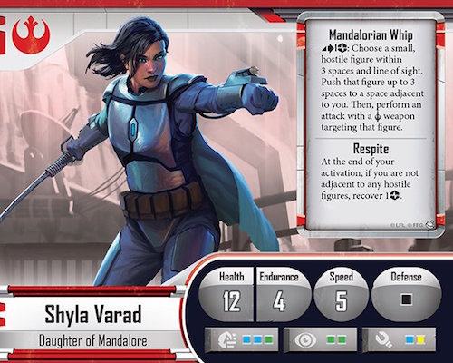

## Vinto Hreeda

* **Class** Ranged
* **Strategy** Fighter/Tank Support

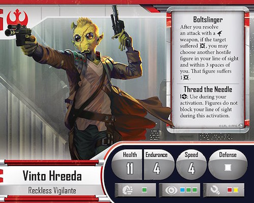
