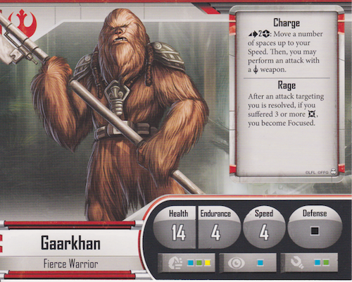

# Hero Intros

## Diala Passil

* **Class** Melee
* **Strategy** Supporting Tanks

## Fenn Signis

* **Class** Ranged
* **Strategy** Breaking from the pack and fighting independant

## Gaarkhan

* **Class** Melee
* **Strategy** Tank

## Gideon Argus

* **Class** Ranged
* **Strategy** Support/Buff other units

## Jyn Odan

* **Class** Ranged
* **Strategy** Support Tanks

## Mak Eshka'rey

* **Class** Ranged
* **Strategy** Ranged Fire

## Biv Bodhrik

* **Class** Ranged and Melee
* **Strategy** Tank

## Saska Teft

* **Class** Ranged
* **Strategy** Support and equip units

## Loku Kanoloa

* **Class** Ranged
* **Strategy** Ranged Fire

## MHD-19

* **Class** Ranged
* **Strategy** Support and heal units

## Verena Talos

* **Class** Ranged and Melee
* **Strategy** Support Tanks

## Davith Elso

* **Class** Melee
* **Strategy** Objective & positioning focused

## Murne Rin

* **Class** Ranged
* **Strategy** Support/Deception 

## Onar Koma

* **Class** Ranged
* **Strategy** Tank

## Shyla Varad

* **Class** Melee
* **Strategy**

## Vinto Hreeda

* **Class** Ranged
* **Strategy**

